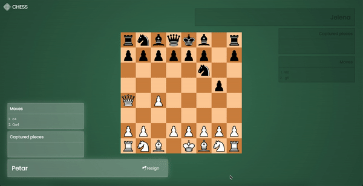
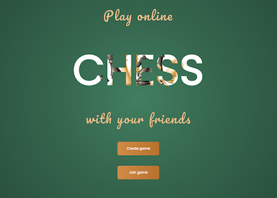
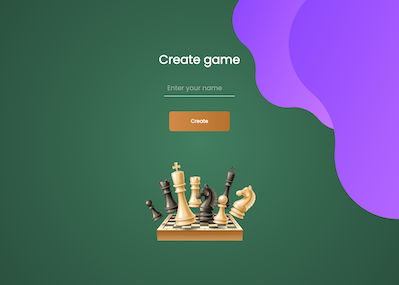
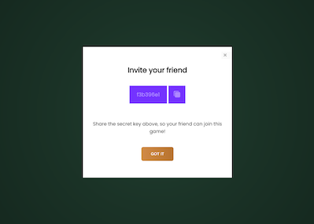
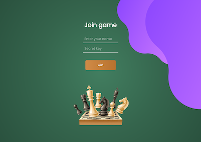
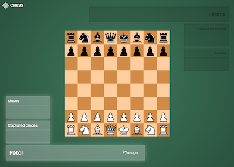
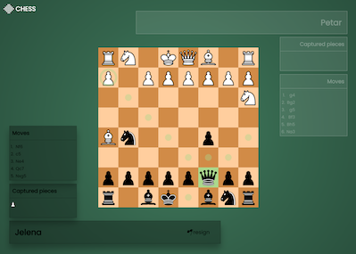
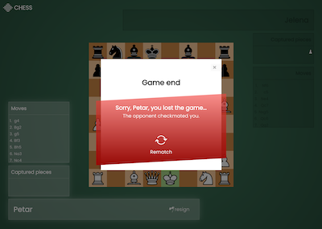
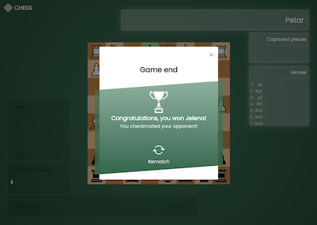

# Chess ♟️♟️♟️

> Online multiplayer chess game.

## How it is built?

- ReactJS (functional components, incl. React hooks);
- TypeScript;
- Redux (Toolkit);
- Styled Components (styling adapted for mobile and desktop);
- Testing with Jest and React Testing Library - 🔜 to be completed;
- Firebase Realtime Database.

## Usage

This app is classic implementation of a board game Chess - all rules are taken from official [Wikipedia](https://en.wikipedia.org/wiki/Chess) page.

- Online (i.e. real-time) game for two known players;
- Authentication is not required - one player can easily create room and share specifically generated key to other player to join;
- Resign option included;
- Specific move types are supported, such as en passant, castling and pawn promotion;
- After game end (either by checkmate or resign of opponent), players have option to take rematch.

Enjoy! 🚀 🚀 🚀
